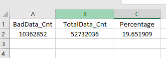

# ITMD-521 Cluster Analysis

# tpatil3
Private repo for ITM
# Tanmay Patil

## Phase 1

I have used the csv file from last assignment and performed all the analysis in this assignment. Last assignment's CSV file location:  ```hdfs://namenode/output/itmd-521/tdp/2001/csv-file```


I had uploaded the results out to: ```hdfs://namenode/output/itmd-521/tdp/```

## Question 1 - Air Temperature and Atmospheric Pressure

## Answer

* An additional Dataframe written to a file that has three columns: the total record count, the bad record count, and the percentage (bad/total)
  * Here's the screenshot for AirTemperature:
 <p align="center">
  
</p>

* An additional Dataframe written to a file that has three columns: the total record count, the bad record count, and the percentage (bad/total)
   * Here's the screenshot for Atmospheric Pressure :
<p align="center">
  
</p>

## Question 2 - Explain Partition Effect

* Briefly explain in a paragraph with references, what happens to execution time when you reduce the shuffle partitions from the default of 200 to 20?

## Answer

### Referring Chapters 02, 10, 15 and 18
Each job breaks down into a series of stages, the number of which depends on how many shuffle operations need to take place. A shuffle represents a physical repartitioning of the data—for example, sorting a DataFrame, or grouping data that was loaded from a file by key (which requires sending records with the same key to the same node). This type of repartitioning requires coordinating across executors to move data around. The spark.sql.shuffle.partitions default value is 200, which means that when there is a shuffle performed during execution, it outputs 200 shuffle partitions by default. We are changing this value to 20, and the number of output partitions will change 20 shuffle partitions. With different values of the shuffle partitions, we see different runtimes

Codeline for setting the shuffle partitions to 20: ```spark.conf.set("spark.sql.shuffle.partitions",20)```


### Execution time for default value of shuffle partitions:
<p align="center">
  
</p>

### Execution time for shuffle partitions = 20:

<p align="center">
  
</p>

Therefore, would like to conclude that the number of partitions should be larger than the number of executors on your cluster, potentially by multiple factors depending on the workload. If you are running code on your local machine, it would behoove you to set this value lower because your local machine is unlikely to be able to execute that number of tasks in parallel. This is more of a default for a cluster in which there might be many more executor cores to use. Regardless of the number of partitions, that entire stage is computed in parallel. The final result aggregates those partitions individually, brings them all to a single partition before finally sending the final result to the driver.

* Retrieve the minimum and maximum AirTemperature for each of the 12 months for the decade.

## Answer

Below are the screenshots for the minimum and maximum AirTemperature for 2 months for the decade. Similarly, 12 files have been created for each month.

<p align="center">
  
</p>

<p align="center">
  
</p>


## Question 3

* Using the .partitionBy partition your year’s data by Month

## Answer

### Referring Chapter 09
partitionBy is used to control the specific layout of the files at the destination.
Below is the screenshot taken of the number of files created. Total 12 files have been created for each month after using .partitionBy

<p align="center">
  
</p>

* lz4 compression

Using the code line : 
```df2.write.format("json").option("compression","lz4").save("hdfs://namenode/output/itmd-521/tdp/2001/lz4/json")```

Below is the screenshot of the list of the files created after lz4 compression:

 <p align="center">
  
</p>

Similarly lz4 compression has been performed for csv files.

## Question 4

## Answer

* Show a screenshot of the execution times for your year
  * 1
 <p align="center">
  
</p>

  * 50
  <p align="center">
  
</p>

  * 200
 <p align="center">
  
</p>

* Show a screenshot of the execution times for your decade
  * 1
  <p align="center">
  
</p>

  * 50
 <p align="center">
  
</p>

  * 200
  <p align="center">
  
</p>

* Compare the execution times and explain why or why not there are any significant differences in the first group and in the second group

### Referring Chapter 13
The repartition operation allows you to repartition your data up or down but performs a shuffle across nodes in the process. Increasing the number of partitions can increase the level of parallelism when operating in map- and filter-type operations. We use. repartition()  only when we are increasing the number of partitions to perform full shuffle.  repartition() is used to shuffle the data across the nodes and increase the level of parallelism thus ideally decreasing the runtime. . But as we can see the execution status using all three partitions is approximately same or with very less difference, which could be due to the increase workload across the cluster. But as we can see the execution status using all three partitions is with very less difference, which could be due to the increase workload across the cluster. The execution of single year ‘2001’ with. repartition() happened much quickly than of that of decade data ‘2000-2005’ with .repatition().