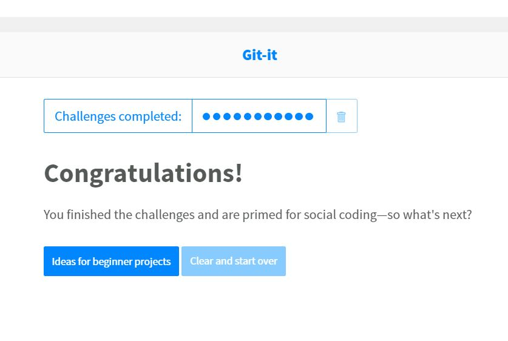

# tpatil3
Private repo for ITM
# Tanmay Patil

## Where are you from?

From the financial capital of India "MUMBAI".

## IT Interest

My background is as Assistant System Engineer. I have interest in these four fields: information security, database and network management, computer technical support, and business software development. I have worked on front-end and java development in my internships.

## Something Interesting About You
I look for positivity in all things.
Instead of thinking of all the things that can go wrong, become one of the people who look on how they go right. Your mind is powerful, and when you fill it with positivity your life naturally becomes positive. When you think positive thoughts, positive things will happen.

## Git-IT Tutorial Badge

